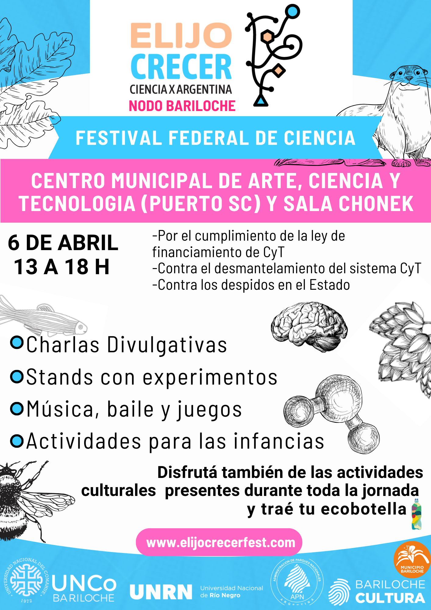
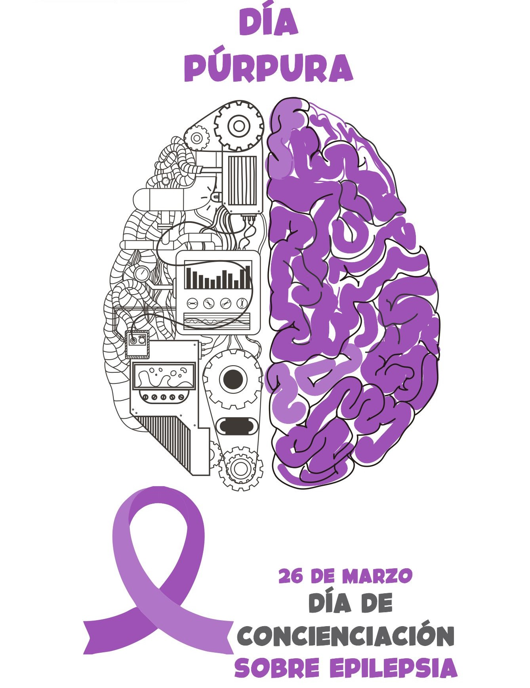

<!---
Link to the google drive:
https://drive.google.com/drive/folders/14gJxPP3Jr46huA5qB-scOJyFUpYCBe7K?usp=drive_link

Refs:
https://docs.github.com/en/get-started/writing-on-github/getting-started-with-writing-and-formatting-on-github/basic-writing-and-formatting-syntax

https://stackoverflow.com/questions/24383700/resize-image-in-the-wiki-of-github-using-markdown
https://stackoverflow.com/questions/14675913/changing-image-size-in-markdown
https://stackoverflow.com/questions/255170/markdown-and-image-alignment
https://github.com/ElectricRCAircraftGuy/eRCaGuy_hello_world/blob/master/markdown/github_readme_center_and_align_images.md

https://stackoverflow.com/questions/66828242/how-to-add-tab-spaces-in-git-readme-between-two-sentences
--->

# Festival de Ciencia: Elijo Crecer 2024
Difusión de actividades científicas realizadas en Bariloche.

## Ciencia X Argentina - Nodo Bariloche

<p align="center">
<!---  --->

</p>

<!---  --->


<!---  --->


**Sitio web Bariloche**\
[elijocrecer-brc](https://sites.google.com/view/elijocrecer-brc)\
**Sitio web nacional**\
[elijocrecerfest.com](http://elijocrecerfest.com/)

**E-mail**\
[elijocrecerbrc@gmail.com](elijocrecerbrc@gmail.com)

**Instagram**\
[@elijocrecerfest](https://www.instagram.com/elijocrecerfest/)\
[@elijocrecerfest.brc](https://www.instagram.com/elijocrecerfest.brc/)

**X**\
[twitter.com/ElijoCrecer](https://twitter.com/ElijoCrecer)
<br clear="left"/>

## Información sobre el festival

Festival federal en defensa de la ciencia y la tecnología argentinas, que incluye [más de 80 nodos](https://www.google.com/maps/d/u/0/viewer?hl=es&ll=-29.080514765030557%2C-63.75440013671128&z=5&mid=15G0hhOJAzpDsBEeY5ecu3O_jOmDunB8) a lo largo de nuestro país.

[Nota en el sitio web de la UNCOMA](https://extension.uncoma.edu.ar/index.php/prensa/festival-elijo-crecer/)

[Nota en el sitio web de la UNRN](https://www.unrn.edu.ar/eventos/Elijo-Crecer-2064)

[Nota en el diario Río Negro](https://www.rionegro.com.ar/sociedad/elijo-crecer-fest-llega-el-festival-hecho-a-pulmon-para-mostrar-la-extraordinaria-calidad-de-la-ciencia-argentina-3462956/)

[Nota en en el sitio web noticiasdebariloche.com.ar](https://www.noticiasdebariloche.com.ar/elijo-crecer-fest-llega-el-festival-hecho-a-pulmon-para-mostrar-la-extraordinaria-calidad-de-la-ciencia-argentina/)

<br>
<p align="center">  </p>

### Charlas de divulgación (Sala Chonek - Museo de la Patagonia, Centro Cívico)

- 11hs: **¿Cómo se "fabrica" una manzana?**\
*Marina Arbetman*, investigadora del [CONICET - INIBIOMA](https://www.conicet.gov.ar/new_scp/detalle.php?id=56945&datos_academicos=yes)

- 12hs: **Acerca de cuantas vidas esta hecho un árbol**\
*Maria Laura Suarez*, investigadora del [CONICET - INIBIOMA](https://www.conicet.gov.ar/new_scp/detalle.php?id=31657&datos_academicos=yes&keywords=inibioma)

- 13hs: **Argentina y Francia investigan mejoras en el tratamiento de la epilepsia** [(video)](https://youtu.be/zaysC2G6Ywo)\
*Damián Dellavale*, investigador del [CONICET - Centro Atómico Bariloche](https://www.conicet.gov.ar/new_scp/detalle.php?id=39010&datos_academicos=yes)

- 14hs: **¿Cuál es la utilidad de la investigación en física básica?**\
*Diego Mazzitelli*, investigador del [CONICET - Centro Atómico Bariloche](https://www.conicet.gov.ar/new_scp/detalle.php?id=19815&keywords=&datos_academicos=yes)

- 15hs: **Presentando al pájaro Carpintero Gigante, vecino del barrio arbolado**\
*Valeria Ojeda*, investigadora del [CONICET - Centro Atómico Bariloche](https://www.conicet.gov.ar/new_scp/detalle.php?keywords=&id=24326&datos_academicos=yes)

- 16hs: **Trucha, parásito y persona y un punto de encuentro: tu intestino** [(video)](https://drive.google.com/file/d/1OSppQhG0jluMeeQQzXRqrs4CydYnphRV/view?usp=drive_link)\
*Gustavo Viozzi*, docente de la [Universidad del Comahue](https://academica.uncoma.edu.ar/), investigador del [CONICET - INIBIOMA](https://www.conicet.gov.ar/new_scp/detalle.php?id=24510&datos_academicos=yes)

- 17hs: **Grandes proyectos tecnológicos y transición energética**\
*Adriana Serquis*, investigadora del [CONICET](https://www.conicet.gov.ar/new_scp/detalle.php?id=22731&datos_academicos=yes), Presidenta de la [Comisión Nacional de Energía Atómica (CNEA)](https://www.argentina.gob.ar/cnea)

### Estands de divulgación (Av. 12 de Octubre #14, ex-Puerto San Carlos)

- **Juegos de Química**\
*Andrea Bellver* investigadora en la [Comisión Nacional de Energía Atómica - Centro Atómico Bariloche](https://www.argentina.gob.ar/cnea/cab)

- **La Fabrica de Neuronas**\
*Lucas Mongiat*, investigador del [CONICET - Centro Atómico Bariloche](https://www.conicet.gov.ar/new_scp/detalle.php?id=27806&datos_academicos=yes)

- **Analisis de lúpulo**\
*Luciana Cavallini*, investigadora del [CONICET - IPATEC](https://www.conicet.gov.ar/new_scp/detalle.php?id=56564&datos_academicos=yes&keywords=)

- **Anfibios y reptiles: Animales sorprendentes que aportan a nuestra vida cotidiana** [(video)](https://drive.google.com/file/d/1Mn55WxncilVPhhd9wyhQhznBk8edH8RG/view?usp=drive_link)\
*Maria Gabriela Perotti*, investigadora del [CONICET - INIBIOMA](https://www.conicet.gov.ar/new_scp/detalle.php?id=19913&keywords=gabriela+perotti&datos_academicos=yes)

- **Anillos de Árboles: ¿Qué historias nos pueden contar?**\
*Maria Laura Suarez*, investigadora del [CONICET - INIBIOMA](https://www.conicet.gov.ar/new_scp/detalle.php?id=31657&datos_academicos=yes&keywords=inibioma)

- **La mesa de las plumas: Para jugar en familia y aprender de las aves de Bariloche**\
*Lucía Bocelli*, investigadora en el grupo de Biología y Ecología de Animales Patagónicos [CONICET- BEAP](https://inibioma.conicet.gov.ar/zoologia/)\
<!--- [naturalezasur.com.ar](https://naturalezasur.com.ar/) -->

- **Magnetismo en la vida cotidiana**\
*Elin Winkler*, investigadora del [CONICET - Centro Atómico Bariloche](https://www.conicet.gov.ar/new_scp/detalle.php?id=22955&datos_academicos=yes)

- **¿Ciencia y Poesía? Experimentaciones poéticas y conocimientos plurales**\
*Gabriela Klier*, investigadora del [CONICET - CITECDE](https://www.conicet.gov.ar/new_scp/detalle.php?id=40871&datos_academicos=yes&keywords=)\
[CITECDE - URN](https://www.institutocitecde.com/)\
[Asamblea de Poetas Bariloche](https://www.elcordillerano.com.ar/noticias/2024/01/24/180316-vamos-a-poetizar-para-provocar-un-sismo-en-la-crueldad-normalizada)

- **Una Argentina sin ciencia**\
*Grupo de Investigaciones en Biología de la Conservación (GrInBiC)*, [grinbic.wordpress.com](https://grinbic.wordpress.com/)\
[GrInBiC en INIBIOMA](https://inibioma.conicet.gov.ar/tag/grinbic/)\
[instagram.com/grinbic](https://www.instagram.com/grinbic/)

- **Crecer cristales**\
*Diego Franco*, investigador del [CONICET - Centro Atómico Bariloche](https://www.conicet.gov.ar/new_scp/detalle.php?id=27844&datos_academicos=yes)

**De modelos matemáticos al entendimiento de la naturaleza**\
*Ana Clara Rodriguez Quinteros*, estudiante avanzada de doctorado [CONICET - INIBIOMA](https://www.conicet.gov.ar/new_scp/detalle.php?id=55324&datos_academicos=yes)

**Los fósiles y la Paleontología**\
*Mauro Passalia*, investigadora del [CONICET - INIBIOMA](https://www.conicet.gov.ar/new_scp/detalle.php?id=26933&datos_academicos=yes)


- **¿Cómo nos ayuda la matemática a entender las enfermedades neurológicas?**\
*Damián Dellavale*, investigador del [CONICET - Centro Atómico Bariloche](https://www.conicet.gov.ar/new_scp/detalle.php?id=39010&datos_academicos=yes)



**26 de Marzo: Día Mundial para la Concienciación de la Epilepsia**

**[Reseña en el Centro de Estudios en Neurociencias y Sistemas Complejos (ENyS - CONICET) - Hospital El Cruce - Universidad Nacional Arturo Jauretche](https://enys.conicet.gov.ar/el-26-de-marzo-se-celebra-el-dia-de-la-epilepsia/)**

**[Nota en el Centro de Estudios en Neurociencias y Sistemas Complejos (ENyS - CONICET) - Hospital El Cruce - Universidad Nacional Arturo Jauretche](https://enys.conicet.gov.ar/dia-mundial-para-la-concientizacion-de-la-epilepsia-la-enfermedad-tambien-puede-presentarse-despues-de-los-60/)**

**[Purple Day: de qué se trata la campaña para concientizar sobre la epilepsia](https://www.pagina12.com.ar/724432-purple-day-de-que-se-trata-la-campana-para-concientizar-sobr)**

**[#purpleday](https://www.facebook.com/hashtag/purpleday)**
<br clear="left"/>

## Información sobre la grave situación actual de la ciencia y soberanía argentinas

- [Comunicación de autoridades de Centros Científicos Tecnológicos del CONICET](https://patagonianorte.conicet.gov.ar/comunicacion-de-autoridades-de-centros-cientificos-tecnologicos-del-conicet/)

- En Marzo de 2024, 68 premios nobel enviaron una carta al actual presidente de la República Argentina manifestando su preocupación por los irracionales recortes presupuestarios al sistema científico y tecnológico argentino, los cuales atentan contra la soberanía nacional.
Uno de los firmantes de la carta es premio nobel en Economía.
  - [Carta original en inglés](Elijo_Crecer_2024/Letter-to-Javier-Milei-and-colleagues.pdf)
  - [Nota del diario Tiempo Argentino que incluye una traducción de la carta al castellano](https://www.tiempoar.com.ar/ta_article/68-nobel-carta-milei-ciencia/)
  - [Nota en la prensa internacional](https://www.dw.com/es/cient%C3%ADficos-piden-a-javier-milei-revertir-recortes-a-ciencia/a-68458755)

- Notas de ***Nature***, una de las revistas científicas internacionales de mayor impacto, sobre los recortes al presupuesto de la salud y ciencia Argentina.
  - Septiembre 2023: [Argentina, la ciencia pública está amenazada](https://www.nature.com/articles/d41586-023-02862-5)
  - Octubre 2023: [Elecciones en Argentina, el candidato favorito promete recortar la financiación científica](https://www.nature.com/articles/d41586-023-03191-3)
  - Noviembre 2023: [Recortes presupuestarios en salud y ciencia no deberían ser una opción en las elecciones presidenciales de Argentina](https://www.nature.com/articles/d41586-023-03480-x)
  - Noviembre 2023: ["Extremadamente preocupante", investigadores argentinos se tambalean tras la elección de un presidente anticientífico](https://www.nature.com/articles/d41586-023-03620-3)
  - Marzo 2024: ["Desesperación", investigadores argentinos protestan mientras el presidente comienza a desmantelar la ciencia](https://www.nature.com/articles/d41586-024-00628-1)
  - Marzo 2024: [Los riesgos para la salud de la política neoliberal extrema en Argentina](https://www.nature.com/articles/d41591-024-00019-z)

- Repercuciones en la prensa internacional por la falta de entrega de medicamentos a pacientes oncológicos de Argentina.
  - Marzo 2024: [Pacientes oncológicos sin remedios en Argentina](https://www.dw.com/es/pacientes-oncol%C3%B3gicos-sin-remedios-en-argentina/video-68423277)

### Prensa local

[Trabajadores del Conicet protestaron en Bariloche contra el avance de los despidos](https://www.rionegro.com.ar/gremios/trabajadores-del-conicet-protestaron-en-bariloche-contra-el-avance-de-los-despidos-3486094/)

[Descubre las últimas noticias sobre CONICET](https://www.rionegro.com.ar/tag/conicet/)

<br> Podrás encontrar el material asociado a estos links en la carpeta ```Elijo_Crecer_2024/``` (ubicada más arriba en esta página).