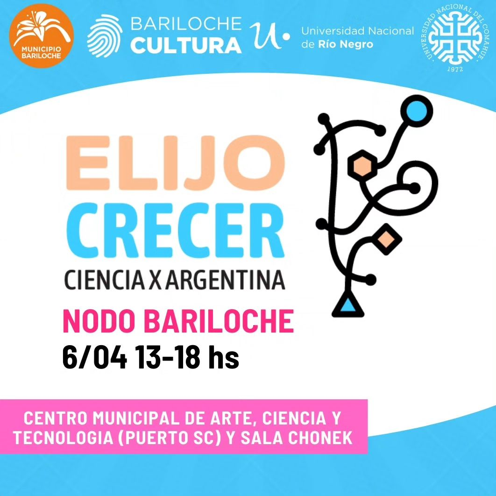

<!---
Link to the google drive:
https://drive.google.com/drive/folders/14gJxPP3Jr46huA5qB-scOJyFUpYCBe7K?usp=drive_link

Refs:
https://docs.github.com/en/get-started/writing-on-github/getting-started-with-writing-and-formatting-on-github/basic-writing-and-formatting-syntax

https://stackoverflow.com/questions/24383700/resize-image-in-the-wiki-of-github-using-markdown
https://stackoverflow.com/questions/14675913/changing-image-size-in-markdown
https://stackoverflow.com/questions/255170/markdown-and-image-alignment
https://github.com/ElectricRCAircraftGuy/eRCaGuy_hello_world/blob/master/markdown/github_readme_center_and_align_images.md

https://stackoverflow.com/questions/66828242/how-to-add-tab-spaces-in-git-readme-between-two-sentences
--->

# Festival de Ciencia: Elijo Crecer 2024
Difusión de actividades científicas realizadas en Bariloche.

## Ciencia X Argentina - Nodo Bariloche

<p align="center">
<!---  --->

</p>

<!---  --->


<!---  --->


**Sitio web Bariloche**\
[elijocrecer-brc](https://sites.google.com/view/elijocrecer-brc)\
**Sitio web nacional**\
[elijocrecerfest.com](http://elijocrecerfest.com/)

**E-mail**\
[elijocrecerbrc@gmail.com](elijocrecerbrc@gmail.com)

**Instagram**\
[@elijocrecerfest](https://www.instagram.com/elijocrecerfest/)\
[@elijocrecerfest.brc](https://www.instagram.com/elijocrecerfest.brc/)

**X**\
[twitter.com/ElijoCrecer](https://twitter.com/ElijoCrecer)
<br clear="left"/>

## Información sobre el festival

Festival federal en defensa de la ciencia y la tecnología argentinas, que incluye [más de 80 nodos](https://www.google.com/maps/d/u/0/viewer?hl=es&ll=-29.080514765030557%2C-63.75440013671128&z=5&mid=15G0hhOJAzpDsBEeY5ecu3O_jOmDunB8) a lo largo de nuestro país.

<p align="center">  </p>

### Charlas de divulgación sobre ciencia en Bariloche

- **Trucha, parásito y persona y un punto de encuentro: tu intestino** [(video)](https://drive.google.com/file/d/1OSppQhG0jluMeeQQzXRqrs4CydYnphRV/view?usp=drive_link)\
Disertante: [Gustavo Viozzi](https://www.instagram.com/gustavoviozzi/), Docente de la [Universidad del Comahue](https://academica.uncoma.edu.ar/), Investigador del [INIBIOMA - CONICET](https://inibioma.conicet.gov.ar/).

- **Argentina y Francia investigan mejoras en el tratamiento de la epilepsia** [(video)](https://youtu.be/zaysC2G6Ywo)\
Disertante: [Damián Dellavale](https://www.researchgate.net/profile/Damian-Dellavale), Investigador del [CONICET - Centro Atómico Bariloche](https://www.conicet.gov.ar/new_scp/detalle.php?id=39010&datos_academicos=yes).


**26 de Marzo: Día Mundial para la Concienciación de la Epilepsia**

**[Purple Day: de qué se trata la campaña para concientizar sobre la epilepsia](https://www.pagina12.com.ar/724432-purple-day-de-que-se-trata-la-campana-para-concientizar-sobr)**

**[#purpleday](https://www.facebook.com/hashtag/purpleday)**
<br clear="left"/>

### Estands de divulgación sobre ciencia en Bariloche

- **Anfibios y reptiles: Animales sorprendentes que aportan a nuestra vida cotidiana.** [(video)](https://drive.google.com/file/d/1Mn55WxncilVPhhd9wyhQhznBk8edH8RG/view?usp=drive_link)\
A cargo de: [Maria Gabriela Perotti](https://www.conicet.gov.ar/new_scp/detalle.php?id=19913&keywords=gabriela+perotti&datos_academicos=yes), Investigadora del [INIBIOMA - CONICET](https://inibioma.conicet.gov.ar/).

## Información sobre la grave situación actual de la ciencia y soberanía argentinas

- En Marzo de 2024, 68 premios nobel enviaron una carta al actual presidente de la República Argentina manifestando su preocupación por los irracionales recortes presupuestarios al sistema científico y tecnológico argentino, los cuales atentan contra la soberanía nacional.
Uno de los firmantes de la carta es premio nobel en Economía.
  - [Carta original en inglés](Elijo_Crecer_2024/Letter-to-Javier-Milei-and-colleagues.pdf)
  - [Nota del diario Tiempo Argentino que incluye una traducción de la carta al castellano.](https://www.tiempoar.com.ar/ta_article/68-nobel-carta-milei-ciencia/)
  - [Nota en la prensa internacional](https://www.dw.com/es/cient%C3%ADficos-piden-a-javier-milei-revertir-recortes-a-ciencia/a-68458755)

- Notas de la revista ***Nature***, una de las revistas científicas internacionales de mayor impacto, sobre los recortes al presupuesto de la salud y ciencia Argentina.
  - Septiembre 2023: [Argentina, la ciencia pública está amenazada](https://www.nature.com/articles/d41586-023-02862-5)
  - Octubre 2023: [Elecciones en Argentina, el candidato favorito promete recortar la financiación científica](https://www.nature.com/articles/d41586-023-03191-3)
  - Noviembre 2023: [Recortes presupuestarios en salud y ciencia no deberían ser una opción en las elecciones presidenciales de Argentina](https://www.nature.com/articles/d41586-023-03480-x)
  - Noviembre 2023: ["Extremadamente preocupante", investigadores argentinos se tambalean tras la elección de un presidente anticientífico](https://www.nature.com/articles/d41586-023-03620-3)
  - Marzo 2024: ["Desesperación", investigadores argentinos protestan mientras el presidente comienza a desmantelar la ciencia](https://www.nature.com/articles/d41586-024-00628-1)
  - Marzo 2024: [Los riesgos para la salud de la política neoliberal extrema en Argentina](https://www.nature.com/articles/d41591-024-00019-z)

- Repercuciones en la prensa internacional por la falta de entrega de medicamentos a pacientes oncológicos de Argentina.
  - Marzo 2024: [Pacientes oncológicos sin remedios en Argentina](https://www.dw.com/es/pacientes-oncol%C3%B3gicos-sin-remedios-en-argentina/video-68423277)

<br> Podrás encontrar el material asociado a estos links en la carpeta ```Elijo_Crecer_2024/``` (ubicada más arriba en esta página).